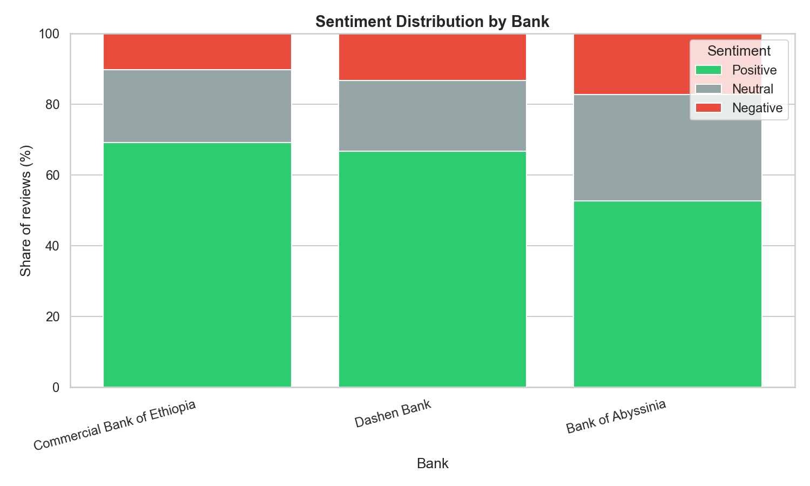
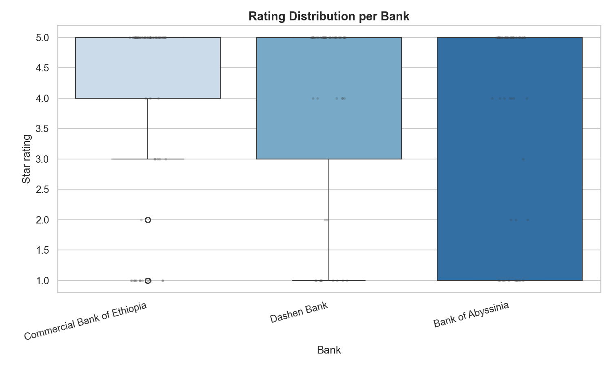
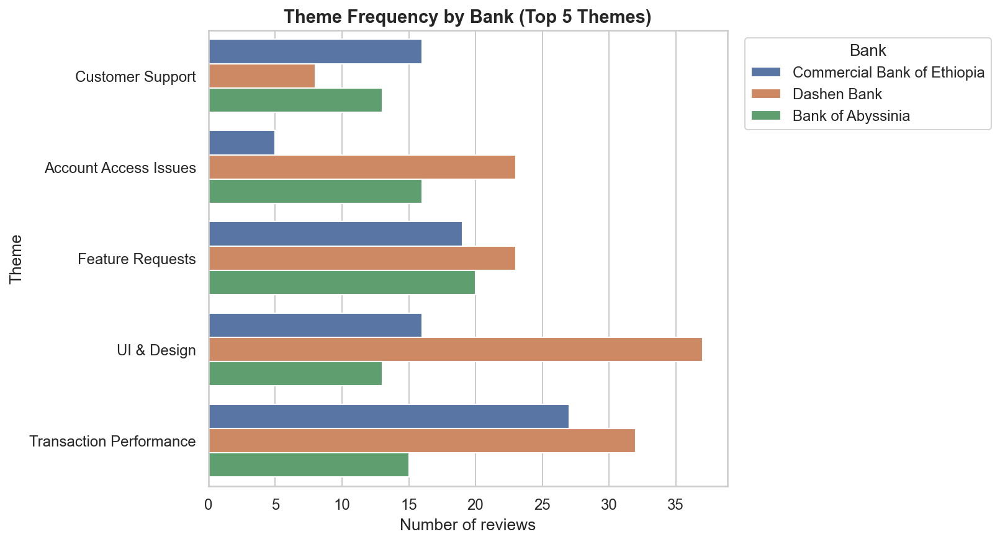
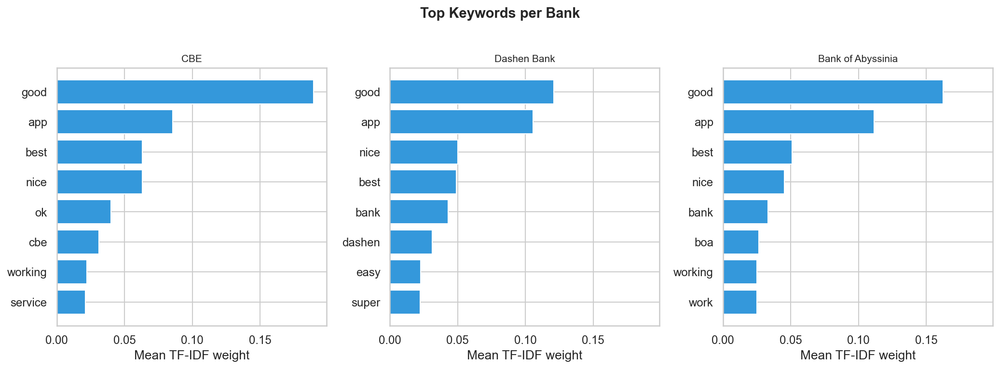
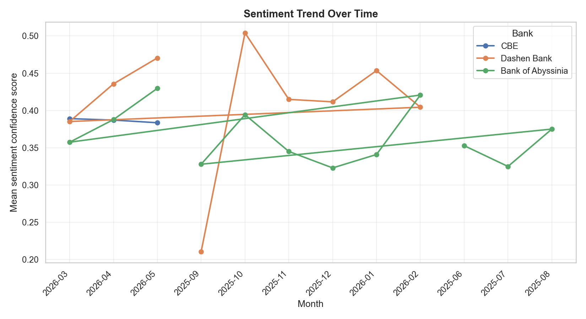

# Ethiopian Mobile Banking Apps: What 1,200 Google Play Reviews Reveal

*A data-driven review of Commercial Bank of Ethiopia, Dashen Bank, and Bank of Abyssinia mobile apps — synthesized from sentiment and thematic analysis of real user feedback.*

---

## Executive Summary

We analyzed **1200** Google Play reviews collected across three major Ethiopian banks. **100.0%** received sentiment labels; **63%** were positive overall, but pain clusters around **login/OTP**, **slow transfers**, and **support responsiveness** vary sharply by institution.

**Headline findings:**

- **Commercial Bank of Ethiopia**: avg rating **4.16★**, 69.2% positive sentiment; dominant complaint theme: **Transaction Performance**
- **Dashen Bank**: avg rating **3.98★**, 66.8% positive sentiment; dominant complaint theme: **UI & Design**
- **Bank of Abyssinia**: avg rating **3.66★**, 52.8% positive sentiment; dominant complaint theme: **Feature Requests**

---

## Cross-Bank Comparison

| Bank | Avg Rating | Positive % | Negative % | Top Non-General Theme |
|------|------------|------------|------------|------------------------|
| Commercial Bank of Ethiopia | 4.16 | 69.2% | 10.2% | Transaction Performance |
| Dashen Bank | 3.98 | 66.8% | 13.2% | UI & Design |
| Bank of Abyssinia | 3.66 | 52.8% | 17.2% | Feature Requests |

---

## Bank of Abyssinia

**Average rating:** 3.66★  
**Sentiment mix:** positive: 211, neutral: 120, negative: 69

### Satisfaction Drivers

- **Positive mentions of 'easy'** — 3 reviews, avg rating 4.33/5
  - *"easy to understand"*
  - *"All problems are fixed now , easy to use recommended."*

- **Positive mentions of 'good'** — 65 reviews, avg rating 4.85/5
  - *"it's very good app"*
  - *"good up except some sluggishness"*

- **Positive mentions of 'great'** — 5 reviews, avg rating 5.0/5

### Pain Points

- **Account Access Issues** — 10 reviews, avg rating 1.6/5
  - *"I tried to oppen mobile app of BOA, but it can't work on my phone after activation. I can't login to it. the staffs tried their best and asked me the android ve…"*
  - *"the app does not show my account balance correctly compared to what I get with the SMS notification. Again and again I am not able to make transfers because the…"*

- **Transaction Performance** — 9 reviews, avg rating 1.33/5
  - *"it's too slow and when you are in a hurry don't use this app"*
  - *"disappointing experience .couldn't even do transactions ,so slow .you should check and update it please"*

- **UI & Design** — 5 reviews, avg rating 2.0/5
  - *"The app is always glitch seems there's is significant issue from the backend. Can someone take a look on this or just remove from appstore this trash 🗑 🙄. Thank…"*
  - *"not user friendly at all it requires a huge connectivity and also lags many times 😑😑😑"*

### Product & Support Recommendations

1. Stabilize login and OTP flows with retry logic, clearer error messages, and offline-friendly session recovery to reduce authentication drop-offs.
2. Prioritize transfer pipeline performance: surface real-time status, reduce pending-state duration, and alert users proactively on delays.
3. Run targeted UX fixes on navigation and onboarding screens highlighted in negative UI-themed reviews; A/B test simplified transfer flows.

---

## Commercial Bank of Ethiopia

**Average rating:** 4.16★  
**Sentiment mix:** positive: 277, neutral: 82, negative: 41

### Satisfaction Drivers

- **Positive mentions of 'fast'** — 9 reviews, avg rating 4.89/5
  - *"it's the best app i have every seen it is fast and securty"*
  - *"pls make an option fingerprint Biometric payment only, it's fast and secure to pay"*

- **Positive mentions of 'easy'** — 12 reviews, avg rating 4.83/5
  - *"easy to use but hard to find easily"*
  - *"Easy, secure and user friend"*

- **Positive mentions of 'good'** — 91 reviews, avg rating 4.95/5
  - *"it's a good application"*
  - *"Good Application"*

### Pain Points

- **Account Access Issues** — 3 reviews, avg rating 2.33/5
  - *"why it alaways asked me to update every second when I log in."*
  - *"there should be atm voucher access included , and also the app crash sometimes ."*

- **Transaction Performance** — 17 reviews, avg rating 1.53/5
  - *"The app forcefully made me an update, since then every time I try to make a payment it keeps bugging and failing non stop. please fix that . this is a big compa…"*
  - *"after the the recent update the app not responding. even transfer to telebirr isn't working."*

- **UI & Design** — 16 reviews, avg rating 4.44/5
  - *"Very Secure but very poor interface and limited history service. The new colorful version is worst. Visibility and contrast are low. It is just my idea."*
  - *"please use the cute ui as a professional developer"*

### Product & Support Recommendations

1. Stabilize login and OTP flows with retry logic, clearer error messages, and offline-friendly session recovery to reduce authentication drop-offs.
2. Prioritize transfer pipeline performance: surface real-time status, reduce pending-state duration, and alert users proactively on delays.
3. Run targeted UX fixes on navigation and onboarding screens highlighted in negative UI-themed reviews; A/B test simplified transfer flows.

CBE leads on average rating but still sees transfer-themed complaints — protecting reliability at scale should be the top priority.

---

## Dashen Bank

**Average rating:** 3.98★  
**Sentiment mix:** positive: 267, neutral: 80, negative: 53

### Satisfaction Drivers

- **Positive mentions of 'fast'** — 18 reviews, avg rating 4.94/5
  - *"fast and very easy to use"*
  - *"best but not staple suit and not fast"*

- **Positive mentions of 'easy'** — 20 reviews, avg rating 4.95/5
  - *"fast and very easy to use"*
  - *"So great easy wonderfully 😍😍😍"*

- **Positive mentions of 'good'** — 55 reviews, avg rating 4.89/5
  - *"good app but it was doesnt work other bank transfer and require so many updates why"*
  - *"good and easier to used"*

### Pain Points

- **Account Access Issues** — 17 reviews, avg rating 1.71/5
  - *"Very Annoying App i tried to open virtual bank account with fayda but in the end it says something went wrong i tried so many times it says something went wrong…"*
  - *"Wrong advertisement! You can't open an account using the app."*

- **Transaction Performance** — 19 reviews, avg rating 1.53/5
  - *"The worst mobile banking app ever... I don't think I am ever going to deposit anything from now on if I can't use the app properly. At one point it's working an…"*
  - *"i got question why we can't withdraw my remaining 50 birr..... anyother bank let me with draw any amount but dashnbank is kinda of annoying it says it has 50 ha…"*

- **UI & Design** — 3 reviews, avg rating 2.33/5
  - *"when compared this app to CBE&Awash pro CBE&Awash pro is better and simple for using."*
  - *"Only the UI/UX is good, but it doesn't function properly. It's a shame that a leading tech bank has such an app. Amole is far better."*

### Product & Support Recommendations

1. Stabilize login and OTP flows with retry logic, clearer error messages, and offline-friendly session recovery to reduce authentication drop-offs.
2. Prioritize transfer pipeline performance: surface real-time status, reduce pending-state duration, and alert users proactively on delays.
3. Run targeted UX fixes on navigation and onboarding screens highlighted in negative UI-themed reviews; A/B test simplified transfer flows.

---

## Visualization Appendix

---

## Methodology (Brief)

- **Data:** Google Play reviews (400 per bank, Jun 2025 – May 2026)
- **Sentiment:** DistilBERT SST-2 (VADER fallback on Python 3.14)
- **Themes:** Keyword rules + TF-IDF validation (5 business themes)
- **Storage:** PostgreSQL `bank_reviews` schema (Task 3)

*Report generated by `scripts/generate_report.py` — 10 Academy Week 2, Task 4.*